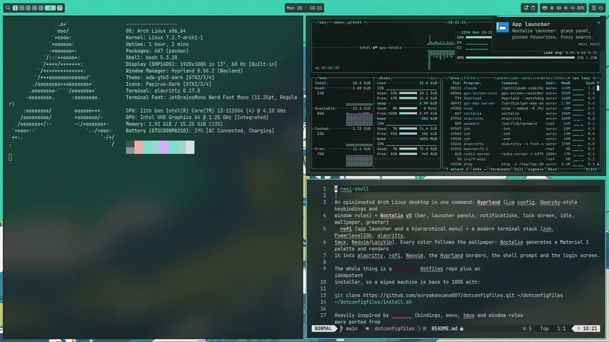

# resi-shell

```
______ _____ _____ _____    ___  ______  _____  _   _
| ___ \  ___/  ___|_   _|  / _ \ | ___ \/  __ \| | | |
| |_/ / |__ \ `--.  | |   / /_\ \| |_/ /| /  \/| |_| |
|    /|  __| `--. \ | |   |  _  ||    / | |    |  _  |
| |\ \| |___/\__/ /_| |_  | | | || |\ \ | \__/\| | | |
\_| \_\____/\____/ \___/  \_| |_/\_| \_| \____/\_| |_/
```

A complete Arch Linux desktop that installs itself: **Hyprland** for windows, **Noctalia** for the bar,
panels, lock screen and login, **rofi** for the launcher and menu, and a modern terminal setup. Pick a
wallpaper and everything follows its colors: terminal, launcher, editor, window borders, prompt, login
screen.

It is built on [Hyprland](https://hypr.land) and [Noctalia](https://noctalia.dev).

**Website with the full guide: <https://resi-arch.kubus.work/>**

[](https://resi-arch.kubus.work/#demo)

*Click the picture to watch the three-minute tour.*

**Contents:** [Install](#install) · [First steps](#first-steps-after-installing) ·
[Everyday keys](#everyday-keys) · [The menu](#the-menu-superspace) · [Features](#features) ·
[The `resi-shell` command](#the-resi-shell-command) · [Several machines](#several-machines) ·
[Troubleshooting](#troubleshooting) · [How the repo is organised](#how-the-repo-is-organised)

---

## Install

There are two ways. Both end with the same desktop.

| | Installer ISO | Script |
|---|---|---|
| Use it when | the machine is new or you want to wipe it | Arch is already installed |
| Internet | not needed | needed |
| Time | a few minutes | 10 to 20 minutes |
| Disk | **erased**, set up as Btrfs + Limine | left as it is |

### Option A: installer ISO

The ISO carries every package it needs, so it installs without internet.

1. **Build the ISO** on any Arch machine (about 4 GB):
   ```sh
   git clone https://github.com/suryakencana007/dotconfigfiles.git ~/dotconfigfiles
   sudo pacman -S archiso
   sudo ~/dotconfigfiles/resi/iso/build.sh        # result: resi/iso/out/resi-shell-<date>-x86_64.iso
   ```
2. **Write it to a USB stick** of 8 GB or more. Check the device name first; `dd` overwrites it without asking:
   ```sh
   lsblk -dpo NAME,SIZE,MODEL,TRAN                # find the stick (TRAN = usb), e.g. /dev/sdb
   sudo dd if=resi/iso/out/resi-shell-*.iso of=/dev/sdX bs=4M status=progress oflag=sync
   ```
3. **Boot the target machine from the stick** (UEFI, Secure Boot off). The installer starts by itself and
   asks for: the disk, a hostname, your user name and password, optional disk encryption, time zone and
   keyboard layout. It shows a summary; choose **Install** to start or **Back** to change an answer.
4. **Wait for "Installed in ..."**, remove the stick, reboot. You get the Resi Arch boot splash and the
   login screen.

> The disk you choose is erased completely, including other operating systems on it.

If the machine had no internet during the install, connect later and run `resi-shell update` once. That
fetches the few things that only exist online (tmux and Neovim plugins) and links the dotfiles to GitHub.

Details, VM testing and how the ISO is built: [`resi/iso/README.md`](resi/iso/README.md).

### Option B: script on an existing Arch install

You need a working Arch system and a user in the `wheel` group (archinstall's defaults are fine).

```sh
sudo pacman -Syu --needed git base-devel
git clone https://github.com/suryakencana007/dotconfigfiles.git ~/dotconfigfiles
cd ~/dotconfigfiles
./install.sh --dry-run        # optional: shows what would happen, changes nothing
./install.sh                  # asks for sudo once
sudo reboot
```

The installer is safe to run again at any time: it only fills in what is missing.

<details>
<summary>What the installer does, step by step</summary>

1. **Packages** from the official repos (`resi/packages.pacman`): Hyprland, Noctalia, rofi, terminal tools,
   fonts, audio, network, greetd, mpv, Plymouth and more.
2. **AUR**: installs `yay` if needed, then `resi/packages.aur` (Brave, Spotify, noctalia-greeter,
   gpu-screen-recorder).
3. **GPU drivers by detection**: NVIDIA (`nvidia-open-dkms`, kernel headers, early KMS), AMD (mesa,
   vulkan-radeon), Intel (mesa, vulkan-intel), plus CPU microcode.
4. **Shell**: oh-my-zsh, Powerlevel10k, fzf-tab; zsh becomes the login shell.
5. **Configs**: links every package of this repo into your home with GNU Stow, plus the overlay for this
   machine when `hosts/<hostname>` exists. Files already in the way are kept as `*.pre-resi`.
6. **Plugins** for tmux (TPM) and Neovim (lazy.nvim).
7. **Folders** (`~/Pictures/Screenshots`, `~/Pictures/Wallpapers`) and your **git identity** (asked once,
   stored locally, never committed).
8. **Services**: NetworkManager, Bluetooth, power-profiles-daemon, greetd.
9. **GTK**: dark mode, adw-gtk3 theme, Papirus icons; mpv as the default player.
10. **Login screen**: noctalia-greeter with its look synced from the desktop.
11. **Boot splash**: the Resi Arch Plymouth theme and bootloader branding (see [Boot splash](#boot-splash)).

At the first login a short one-time step finishes what needs a running desktop: GTK theme, login-screen
sync, the lock-screen layout for your monitor, and the Wallhaven plugin.

</details>

---

## First steps after installing

Log in at the Noctalia login screen, then:

```sh
# 1. See that everything is in place.
resi-shell doctor

# 2. Add wallpapers, then pick one: Super+Ctrl+Space (panel) or Super+Shift+Ctrl+Space (carousel).
cp /path/to/*.jpg ~/Pictures/Wallpapers/

# 3. To push your own changes: create an SSH key and switch the repo to SSH.
ssh-keygen -t ed25519 -C "$(cat /etc/hostname)"
cat ~/.ssh/id_ed25519.pub        # add it at https://github.com/settings/keys
cd ~/dotconfigfiles && git remote set-url origin git@github.com:suryakencana007/dotconfigfiles.git
```

Also worth doing once:

- Press `Super+K` for the full list of key bindings.
- Sign in to Brave and Spotify.
- On a laptop with a second graphics card, set the BIOS to hybrid graphics.
- If Noctalia opens its setup wizard, just go through it. The theme, plugins and color templates already
  come from this repo.

---

## Everyday keys

| Action | Keys |
|---|---|
| Menu / app launcher | `Super+Space` / `Super+Alt+Space` |
| Terminal / terminal with tmux | `Super+Enter` / `Super+Alt+Enter` |
| Browser (Brave) / file manager (Thunar) | `Super+Shift+B` / `Super+Shift+F` |
| Close window / fullscreen / float | `Super+W` / `Super+F` / `Super+T` |
| Focus / swap window / switch workspace | `Super+arrows` / `Super+Shift+arrows` / `Super+1..0` |
| Copy / paste / cut / select all, in every app | `Super+C` / `Super+V` / `Super+X` / `Super+A` |
| Drop-down terminal | ``Super+` `` |
| Control center / session menu / lock | `Super+S` / `Super+Esc` / `Super+Ctrl+L` |
| Clipboard history / wallpaper panel | `Super+Ctrl+V` / `Super+Ctrl+Space` |
| Theme carousel / Wallhaven browser | `Super+Shift+Ctrl+Space` / `Super+Ctrl+Alt+Space` |
| Screenshot: area / window / screen | `Print` / `Shift+Print` / `Ctrl+Print` |
| Record: area / screen (press again to stop) | `Alt+Print` / `Ctrl+Alt+Print` |
| Containers (podman-tui) | `Super+Shift+D` |
| Noctalia settings | `Super+Shift+,` |
| **All key bindings, searchable** | `Super+K` |

---

## The menu (`Super+Space`)

One menu reaches everything. Entries that open a submenu show a `󰅂` on the right. In a submenu,
Backspace on an empty search goes back, and pressing `Super+Space` again closes the menu. **Apps** is a
submenu with every installed application (icons, type to filter, Backspace back to the menu). Typing an
app name at the top level and pressing Enter jumps straight into Apps with that search, so
`Super+Space`, `etch`, Enter, Enter starts balenaEtcher.

| Section | What is inside |
|---|---|
| **Apps** | every installed application, with icons; type to filter |
| **Learn** | key bindings, tmux keys, Hyprland wiki, Noctalia docs |
| **Trigger** | screenshots, screen recording, color picker, clipboard history, calendar |
| **Toggle** | night light, caffeine (no idle lock), Do Not Disturb, bar, Wi-Fi, Bluetooth |
| **Style** | theme carousel, palette and dark/light mode, wallpaper, random wallpaper, Noctalia settings |
| **Setup** | audio, network, Bluetooth, display, monitors, power profile, battery limit, containers, config files |
| **Install** | a package, an AUR package, a development environment, a font, a web app |
| **Update** | resi-shell, firmware, check for updates, restart the shell |
| **Remove** | a package, an AUR package, a development environment, a font, a web app |
| **About** | system information |
| **System** | lock, suspend, hibernate, logout, reboot, shutdown |

Things that would be dangerous ask first: removing a package lists everything that would go and asks
Yes/No, and so does the update.

---

## Features

### Look and theme

- Colors come from the wallpaper. Noctalia builds a palette and renders it into alacritty, rofi, Neovim,
  GTK apps, the Hyprland borders, the prompt and the login screen.
- Bar, panels, notifications and the launcher share one style: frosted glass, square corners, the same
  10 px spacing as the windows.
- Folder icons follow the theme too (`hypr-folder-color` picks the closest Papirus color).
- Thunar and other GTK apps use adw-gtk3 with Papirus icons in dark mode.
- Font everywhere: JetBrains Mono Nerd Font.

### Bar and panels

- Floating bar: launcher and workspaces on the left, date and time in the middle, and on the right the
  tray, network, Bluetooth, volume, brightness and battery. The playing track shows up only while
  something plays.
- Bar buttons: notifications, clipboard, caffeine (keeps the screen awake), night light, dark/light
  switch, control center and session menu. A red **REC** button appears while recording; click it to stop.
- An update button with a count appears when updates exist (left click updates, right click lists them).
- Control center (`Super+S`) with weather and calendar, session menu (`Super+Esc`), wallpaper panel.
- The screen locks after 10 minutes without input and switches off after 11.
- **Lock screen** (hyprlock, `Super+Ctrl+L`): the blurred desktop with a large clock, the date, your
  user name, the password box, the machine name and the battery level, all in the Noctalia colors of
  the current wallpaper. Closing the lid or suspending locks first.

### Screenshots and recording

- Screenshots freeze the screen, let you select an area and annotate it, then go to the clipboard and
  `~/Pictures/Screenshots`.
- Recording uses gpu-screen-recorder: 60 fps with desktop audio, encoded on the GPU. One key starts it,
  the same key stops it.

### Laptops

- **Battery mode**: unplugging switches to the power-saver profile, limits brightness to 50% and lowers
  the refresh rate when the panel allows it. Plugging in restores everything.
- **Power profile** (Setup menu): performance, balanced or power-saver. Your choice is remembered
  separately for battery and charger.
- **Battery limit** (Setup menu): stop charging at 80% for a laptop that is mostly plugged in. It only
  shows up where the battery supports it.
- **Lid**: closing it locks and suspends. With an external monitor attached it only switches the laptop
  panel off (clamshell mode).
- **Night light**: warms the screen from sunset to sunrise.

### Updates

- `resi-shell update` (or Update in the menu) updates this setup, Arch, the AUR and your development
  tools in one go, then offers to remove unused packages and trims old package files. It offers a reboot when the
  kernel or Hyprland changed.
- A background check runs every 6 hours and shows the update button in the bar.
- Update > Firmware installs firmware updates through fwupd.

### Development tools

Install > Development sets up a language with one click; installed ones show a ✓.

- Through [mise](https://mise.jdx.dev): Ruby on Rails, Node.js, Bun, Deno, Go, PHP, Laravel, Symfony,
  Python (with uv), Elixir, Phoenix, Java, Zig, .NET, Clojure, Scala.
- Rust through rustup, OCaml through opam.
- **Databases in containers**: MySQL, PostgreSQL, Redis, MongoDB, MariaDB or MSSQL, reachable only from
  this machine, with development passwords. They run on rootless Podman; `docker` and `docker compose`
  commands keep working.
- **Fonts**: Install > Font installs a Nerd Font straight from its GitHub release, a font file or archive
  you downloaded, or a `ttf-*`/`otf-*` package, into your user font folder; Remove > Font takes them out
  again. No root needed, and every app sees the font right away.
- **Web apps**: Install > Web App turns a website into its own window with an icon in the launcher.
  **WhatsApp** comes preinstalled this way, with a small Brave extension that collapses its chat list
  in narrow windows and makes it follow the dark/light theme.

### Terminal

- alacritty with zsh, oh-my-zsh and a one-line Powerlevel10k prompt.
- Tools: fzf, zoxide, eza, bat, fd, ripgrep, delta, dust, duf, btop, tldr, lazygit.
- Selecting text with the mouse copies it, also inside tmux, and shows a small "Copied" note.
- tmux with `Ctrl+Space` as the prefix, `Alt+Enter` to split and `Alt+1..9` for windows; sessions
  survive a reboot.
- Neovim with LazyVim; its colors change live with the theme.

### Login, passwords and SSH

- Login screen: greetd with noctalia-greeter, wearing the same wallpaper and colors as the desktop.
- Your login password also unlocks the keyring, so Brave can store passwords and SSH keys stay unlocked
  for the session.

### Boot splash

The machine boots with a Resi Arch logo and a progress bar instead of scrolling text, and the boot menu
entry is called "Resi Arch". If the disk is encrypted, the passphrase is asked on the same screen.

It is set up by `resi-shell install` (never by `update`, because it changes the boot configuration):

```sh
sudo ~/dotconfigfiles/resi/boot/setup-boot-splash.sh --check     # report only
sudo ~/dotconfigfiles/resi/boot/setup-boot-splash.sh             # set up (again)
sudo ~/dotconfigfiles/resi/boot/setup-boot-splash.sh --remove    # back to the plain text boot
```

The system stays plain Arch Linux underneath; only the look changes.

---

## The `resi-shell` command

After installing, the installer is available everywhere as `resi-shell`.

| Command | What it does |
|---|---|
| `resi-shell update` | Updates everything: this repo, Arch and AUR packages, development tools, plugins; then reloads the desktop. Asks before it starts (`-y` skips the question). The output is saved in `~/.cache/resi-shell-update.log`. |
| `resi-shell doctor` | Health check. Tells you what is wrong and usually how to fix it. |
| `resi-shell install` | The full setup again. Safe to repeat; add `--dry-run` to only see what it would do. |
| `resi-shell packages` | Prints the package lists. |
| `resi-shell lockscreen-layout` | Writes a centered login box for this machine's monitor on the lock screen (done automatically; `--force` rewrites it). |

<details>
<summary>What <code>update</code> does when you have local changes</summary>

If you edited files in the repo, `update` shows them and offers to set them aside, pull, and put them back
(`git stash`, `git pull`, `git stash pop`). If your branch has commits that are not on GitHub, or a change
conflicts, it stops and prints the exact commands to run.

</details>

<details>
<summary>Commands used by the installer ISO</summary>

| Command | Purpose |
|---|---|
| `resi-shell install --offline` | packages (including pre-built AUR ones) come from the mirror on the ISO, git clones and the Noctalia plugins from bundles on the ISO |
| `resi-shell install --chroot` | runs inside the freshly installed system before its first boot; steps that need a running desktop are postponed |
| `resi-shell first-login` | started by Hyprland; does the postponed steps once |
| `resi-shell iso-relink` | connects a repo installed from the ISO to GitHub (also done by the first `update`) |

</details>

<details>
<summary>What <code>doctor</code> checks</summary>

Stow links and broken links, key files pointing into the repo, Hyprland, Noctalia, rofi, tmux and zsh
configs, script lint, the keyring at login, the background watchers (battery mode, update check,
clipboard note), the login-screen sync, the boot splash, Noctalia settings changed in its GUI that now
override the repo, and whether the repo has uncommitted changes.

</details>

---

## Several machines

The same repo runs on every machine. Graphics drivers are detected, monitors are handled by a wildcard
rule, and the lock-screen layout is generated for the monitor it finds.

Only real one-machine exceptions need a folder: `hosts/<hostname>/`. The installer applies it when the
folder name equals the machine's hostname, and ignores it everywhere else. Two machines are in the repo
as examples, `legionarch` and `dynarch`.

```sh
cd ~/dotconfigfiles
cp -r hosts/legionarch "hosts/$(cat /etc/hostname)"
# edit hosts/<hostname>/.config/hypr/local.lua for monitors or rules of this machine
resi-shell install
git add hosts && git commit -m "Add host overlay for $(cat /etc/hostname)" && git push
```

When you install from the ISO, type the hostname of an existing overlay in the wizard to get it applied.

---

## Troubleshooting

Start with `resi-shell doctor`. Common cases:

| What you see | What to do |
|---|---|
| Colors of an app do not follow the wallpaper | `noctalia-drift` shows settings changed in Noctalia's GUI that override the repo; `noctalia-drift --fix` restores them. |
| The login screen looks default | `noctalia msg greeter-sync` |
| A change in a config file has no effect | Hyprland: `hyprctl reload && hyprctl configerrors`. Noctalia: `noctalia config validate && noctalia msg config-reload`. |
| The bar or a panel is stuck | Menu > Update > Process > Shell restarts Noctalia. |
| Plugins are missing after an offline install | Connect to the internet and run `resi-shell update`. |
| The boot splash hangs or stays black | Press `Esc` to see the text. To turn it off: `setup-boot-splash.sh --remove` (see [Boot splash](#boot-splash)). |
| The update stops because of local changes | Follow the commands it prints, then run `resi-shell update` again. |
| A laptop drains its battery while idle | Check `NOTES.md` for known firmware problems (for example the Dynabook G83/HS). |

[NOTES.md](NOTES.md) explains why things are built the way they are, what to know before editing, and
what was tried and dropped.

---

## How the repo is organised

Each top-level folder is a [GNU Stow](https://www.gnu.org/software/stow/) package that mirrors your home
directory. Configs in `~/.config/...` are links into this repo, so editing either one edits the same file.

| Folder | Contents |
|---|---|
| `hypr` | Hyprland config in Lua: `looknfeel`, `input`, `windows`, `monitors`, `bindings/*`, `autostart` |
| `noctalia` | Noctalia config (`*.toml`) and color templates |
| `rofi` | launcher and menu layout |
| `alacritty`, `tmux`, `zsh`, `nvim`, `git` | terminal stack |
| `gtk`, `mpv`, `brave` | app settings |
| `bin` | helper scripts in `~/.local/bin` and a few launcher entries |
| `claude` | Claude Code skills and agents that know this setup |
| `hosts/<hostname>` | per-machine overlay |
| `resi/` | installer data: package lists, login-screen templates, boot splash (`resi/boot`), ISO builder (`resi/iso`) |
| `docs/` | the website (VitePress), deployed to GitHub Pages by `.github/workflows/docs.yml` |
| `install.sh` | the installer, also installed as `resi-shell` |

Files that Noctalia renders from templates are in `.gitignore` and never committed.

<details>
<summary>Helper scripts</summary>

| Script | Purpose |
|---|---|
| `hypr-menu`, `rofi-toggle` | the menu and launcher toggles |
| `hypr-keybindings` | searchable key binding list (`Super+K`) |
| `hypr-theme`, `hypr-theme-carousel`, `hypr-folder-color` | palettes, dark/light, wallpaper carousel, folder icon color |
| `hypr-record` | screen recording toggle |
| `hypr-pkg-install` | package picker for install and removal (official repos and AUR) |
| `hypr-dev-env`, `hypr-docker-db`, `hypr-containers`, `hypr-webapp` | development environments, databases, podman-tui, web apps |
| `hypr-power` | battery mode, power profile, battery limit |
| `hypr-updates`, `hypr-update-firmware` | update indicator, firmware updates |
| `hypr-monitors`, `hypr-clamshell`, `hypr-lid-close` | monitor layout tool, lid handling |
| `hypr-restart-shell` | restart Noctalia safely |
| `hypr-clipboard-toast` | the "Copied" note for terminal selections |
| `hypr-tui` | runs a command in a floating terminal, with Yes/No prompts |
| `noctalia-drift` | finds Noctalia GUI settings that override the repo |
| `hypr-demo` | records an automatic tour of the features to `~/Videos/resi-shell-demo.mp4` |

</details>

<details>
<summary>Stow details and manual stow</summary>

`hypr`, `noctalia`, `gtk`, `bin`, `claude` and the host overlays are stowed with `--no-folding` (real
folders with one link per file), so machine overlays and rendered files can sit next to the repo files.
The others are stowed normally.

```sh
cd ~/dotconfigfiles
stow -t ~ zsh git alacritty tmux nvim rofi mpv brave
stow --no-folding -t ~ hypr noctalia claude bin gtk
(cd hosts && stow --no-folding -t ~ "$(cat /etc/hostname)")
```

Neovim's `lazy-lock.json` is not committed: each machine keeps its own plugin versions.

</details>

### Day to day

- Edit configs where they are (`~/.config/hypr/...`) or in the repo; it is the same file.
- Values changed in Noctalia's Settings window are stored outside the repo and win over the files here.
  `noctalia-drift` lists them.
- Commit and push from `~/dotconfigfiles`, then run `resi-shell update` on your other machines.

## License

MIT, see [LICENSE](LICENSE). Parts of the Hyprland key bindings, the menu structure and the WhatsApp
browser extension were ported from [Omarchy](https://github.com/omacom/omarchy) (MIT).
